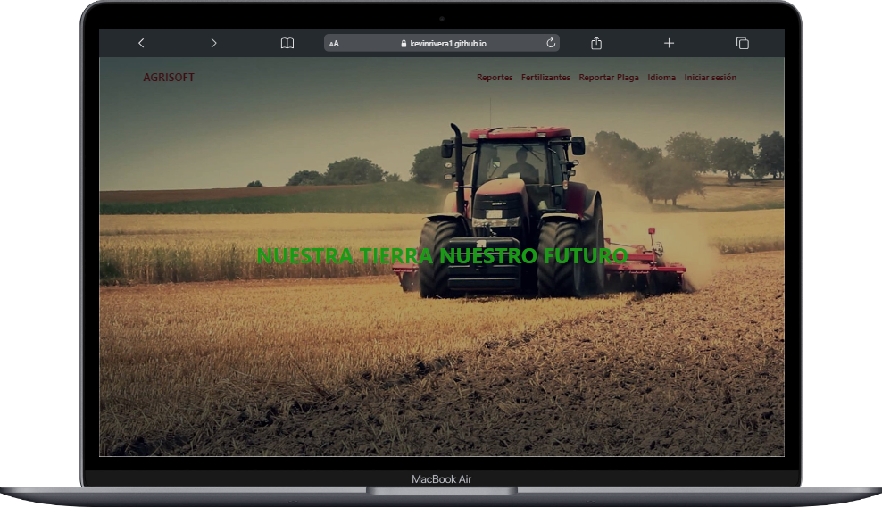

# Catálogo de Fertilizantes para Plantas

Bienvenido a nuestro Catálogo de Fertilizantes para Plantas, una experiencia de jardinería única diseñada en HTML y CSS.

## Tabla de Contenidos

1. [Descripción](#descripción)
2. [Características](#características)
3. [Capturas de Pantalla](#capturas-de-pantalla)
4. [Demo en Vivo](#demo-en-vivo)
5. [Tecnologías Utilizadas](#tecnologías-utilizadas)
5. [Cómo Empezar](#cómo-empezar)
6. [Contribuciones](#contribuciones)

## Descripción

Explora nuestro vibrante catálogo de fertilizantes para plantas, cuidadosamente diseñado en HTML y CSS. Encuentra la solución perfecta para hacer crecer y nutrir tus plantas, desde flores exuberantes hasta verduras saludables.

## Capturas de Pantalla

    

## Demo en Vivo

Puedes ver una demostración en vivo de nuestro catálogo de fertilizantes en [este enlace](https://kevinrivera1.github.io/AGRISOFT2-PROYECTO-INTEGRADOR/).

## Tecnologías Utilizadas

- HTML
- CSS
- JavaScript
- Bootstrap

## Guía sobre Plagas y Fertilizantes

Además del catálogo de fertilizantes, también ofrecemos una completa guía sobre plagas y fertilizantes. Esta guía está diseñada con pasión y dedicación en HTML y CSS para proporcionarte información esencial sobre cómo identificar y combatir plagas, así como seleccionar los fertilizantes adecuados para mantener tus plantas saludables y prósperas.

## Características

- Catálogo de fertilizantes diverso y vibrante.
- Guía informativa sobre plagas y fertilizantes.
- Diseño atractivo y cuidadoso en HTML y CSS.
- Fácil de usar y navegar.

## Cómo Empezar

1. Clona este repositorio: `git clone https://github.com/KevinRivera1/AGRISOFT2-PROYECTO-INTEGRADOR.git`
2. Abre `index.html` en tu navegador para explorar el catálogo de fertilizantes.
3. Visita la página de la guía sobre plagas y fertilizantes en `fertilizantes.html`.

## Contribuciones

¡Estamos abiertos a contribuciones! Si deseas mejorar esta guía, el catálogo de fertilizantes o el diseño en HTML/CSS, no dudes en enviar una solicitud de extracción (**Pull Request**) .